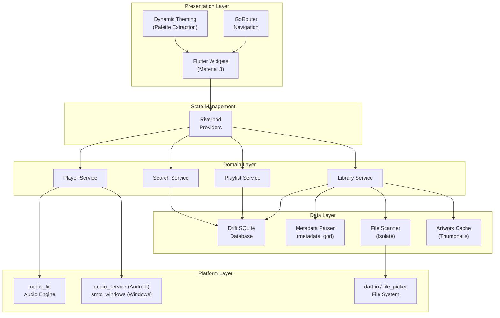

# Sonora — Cross-Platform Offline Music Player

> **Your music, locally.**
>
> An OpenTune-inspired, Material 3 offline music player for Android and Windows.

## Technology Stack Decision

After evaluating Kotlin Multiplatform + Compose, Flutter, and React Native, **Flutter** is the clear winner:

| Requirement | Flutter Solution |
|:---|:---|
| **Material 3** | First-party M3 widgets + `dynamic_color` |
| **Audio Engine** | `media_kit` (libmpv) — unified Android + Windows |
| **Metadata** | `metadata_god` (Rust/lofty FFI) — fast tag + art extraction |
| **Database** | `drift` (type-safe SQLite with reactive streams) |
| **Android Media Controls** | `audio_service` (MediaSession, notifications, lock screen) |
| **Windows Media Keys** | `smtc_windows` (SMTC integration) |
| **File System** | `dart:io` + Isolates + `file_picker` |

## Roadmap

We will approach this in **15 iterative phases**. This ensures stable progress and testable milestones.

### Milestone 1: Foundation (Completed)
- **Phase 1: Project Setup & UI Shell (Completed)**
  - Setup Flutter project (Windows + Android).
  - Setup Material 3 `ThemeData` (Dark/Light).
  - Create `AppShell` with adaptive navigation (BottomNavigationBar for mobile, NavigationRail for desktop).
  - Create mock data models (`Song`, `Album`, `Artist`, `Playlist`).
  - Build UI layout shells for Home, Library, Now Playing, and Mini Player using mock data.

### Milestone 2: Data & State (Completed)
- **Phase 2: Local Database (Completed)**
  - Integrate `drift` (SQLite).
  - Define normalized tables: `Songs`, `Albums`, `Artists`, `Playlists`, `PlaylistEntries`.
  - Create base DAOs.
  - Setup Riverpod providers for database access.

### Milestone 3: Audio Engine (Completed)
- **Phase 3: Real Audio Engine (Completed)**
  - Integrate `media_kit` for cross-platform audio playback.
  - Integrate `audio_service` for Android background playback.
  - Create Riverpod queue manager (`PlaybackStateNotifier`).
  - Connect UI to real playback state instead of mocks.

**Why Flutter over KMP?** Unified audio engine (`media_kit` works identically on both platforms vs needing Media3 + vlcj split), turnkey Windows SMTC package, proven by production apps like Spotube, simpler toolchain.

---

## User Review Required

> [!IMPORTANT]
> **Technology Stack**: This plan uses **Flutter + Dart**. If you have a strong preference for Kotlin Multiplatform or another framework, please indicate before implementation begins.

> [!IMPORTANT]
> **License**: The plan uses the **GPL-3.0** license (matching the spirit of serious open-source music players). Let me know if you prefer MIT, Apache 2.0, or another license.

> [!IMPORTANT]
> **Package Name**: The plan uses `com.sonora.player` as the Android package name. Please confirm or provide your preferred package name.

---

## Open Questions

> [!NOTE]
> **App Icon / Branding**: Should I generate a Sonora logo/icon during implementation, or will you provide one?

> [!NOTE]
> **Visualizer Priority**: The audio visualizer requires platform-specific FFT/audio data access. Should I prioritize it in the initial build or defer it to a polish phase?

> [!NOTE]
> **Minimum Android API**: Targeting **API 24 (Android 7.0)**. Is this acceptable, or do you need lower?

---

## Architecture Overview



---

## Proposed Changes

### Phase 1: Project Foundation & Architecture

#### [NEW] Project scaffold & configuration

| File | Purpose |
|:---|:---|
| `pubspec.yaml` | Flutter project with all dependencies |
| `analysis_options.yaml` | Strict lint rules |
| `lib/main.dart` | App entry point with providers |
| `android/` | Android project (API 24+, media permissions) |
| `windows/` | Windows runner |

**Key dependencies:**
```yaml
dependencies:
  flutter:
    sdk: flutter
  # State Management
  flutter_riverpod: ^2.6.x
  riverpod_annotation: ^2.6.x
  # Navigation
  go_router: ^14.x
  # Database
  drift: ^2.22.x
  sqlite3_flutter_libs: ^0.5.x
  # Audio
  media_kit: ^1.1.x
  media_kit_libs_audio: ^1.0.x
  audio_service: ^0.18.x
  # Metadata
  metadata_god: ^0.5.x
  # UI
  dynamic_color: ^1.7.x
  cached_network_image: ^3.x  # for artwork caching
  palette_generator: ^0.3.x   # artwork color extraction
  # Platform
  file_picker: ^8.x
  path_provider: ^2.x
  permission_handler: ^11.x
  smtc_windows: ^0.1.x
  window_manager: ^0.4.x      # desktop window control
```

---

#### [NEW] `lib/core/` — Core utilities & constants

| File | Purpose |
|:---|:---|
| `lib/core/constants.dart` | App-wide constants (supported formats, sizes) |
| `lib/core/extensions.dart` | Dart extension methods (duration formatting, etc.) |
| `lib/core/logger.dart` | Structured logging |
| `lib/core/platform_utils.dart` | Platform detection helpers |

---

### Phase 2: Design System & Theming

#### [NEW] `lib/theme/` — Material 3 design system

| File | Purpose |
|:---|:---|
| `lib/theme/app_theme.dart` | Light/dark/system M3 `ThemeData` with `ColorScheme.fromSeed` |
| `lib/theme/dynamic_theme_provider.dart` | Riverpod provider for dynamic theming from album art |
| `lib/theme/typography.dart` | M3 type scale customization |
| `lib/theme/dimensions.dart` | Spacing, radii, elevation constants (8dp grid) |

**Design tokens (inspired by OpenTune):**
- Corner radii: pill (999), large (24), medium (16), small (8–12)
- Spacing: 4/8/16/24dp grid
- Typography: M3 scale with bold titles, medium body
- Dynamic color extraction from album artwork via `palette_generator`
- Light / Dark / OLED black themes

---

### Phase 3: Navigation Shell

#### [NEW] `lib/navigation/` — Adaptive navigation

| File | Purpose |
|:---|:---|
| `lib/navigation/app_router.dart` | GoRouter configuration with all routes |
| `lib/navigation/app_shell.dart` | Adaptive scaffold: bottom nav (phone) / nav rail (tablet/desktop) |
| `lib/navigation/destinations.dart` | Navigation destination definitions |

**Navigation architecture:**
- **Phone**: Floating pill-shaped bottom navigation bar (Home, Songs, Albums, Library) with mini player floating above it
- **Tablet/Desktop**: Navigation rail on the left side with expanded labels
- **Windows**: Navigation rail + optional sidebar with resizable panes
- Mini player sits between content and navigation bar on all form factors
- GoRouter with `StatefulShellRoute` preserves scroll state across tabs

---

### Phase 4: Database & Data Layer

#### [NEW] `lib/data/database/` — Drift database

| File | Purpose |
|:---|:---|
| `lib/data/database/app_database.dart` | Main database class with all tables |
| `lib/data/database/tables/songs_table.dart` | Songs table (path, title, artist, album, duration, artwork_path, play_count, last_played, etc.) |
| `lib/data/database/tables/albums_table.dart` | Albums table (name, artist, year, artwork_path, song_count) |
| `lib/data/database/tables/artists_table.dart` | Artists table (name, artwork_path, song_count) |
| `lib/data/database/tables/playlists_table.dart` | Playlists table + playlist_songs junction |
| `lib/data/database/tables/folders_table.dart` | Scanned folders table |
| `lib/data/database/daos/songs_dao.dart` | Song CRUD + queries (sort, filter, search) |
| `lib/data/database/daos/albums_dao.dart` | Album queries |
| `lib/data/database/daos/artists_dao.dart` | Artist queries |
| `lib/data/database/daos/playlists_dao.dart` | Playlist CRUD |

**Schema highlights:**
- `songs`: id, file_path, title, artist, album, album_artist, genre, year, track_number, disc_number, duration_ms, artwork_cache_path, play_count, last_played_at, date_added, file_size, file_modified_at, is_favorite
- `albums`: id, name, artist, year, artwork_cache_path, song_count, total_duration_ms
- `artists`: id, name, artwork_cache_path, song_count, album_count
- `playlists`: id, name, created_at, updated_at
- `playlist_songs`: playlist_id, song_id, sort_order
- `scanned_folders`: id, path, last_scanned_at

---

#### [NEW] `lib/data/models/` — Data models

| File | Purpose |
|:---|:---|
| `lib/data/models/song.dart` | Song model with fromMetadata factory |
| `lib/data/models/album.dart` | Album model |
| `lib/data/models/artist.dart` | Artist model |
| `lib/data/models/playlist.dart` | Playlist model with songs |
| `lib/data/models/playback_state.dart` | Current playback state (playing, position, queue) |

---

### Phase 5: Library Scanner & Metadata

#### [NEW] `lib/services/scanner/` — Background library scanner

| File | Purpose |
|:---|:---|
| `lib/services/scanner/library_scanner.dart` | Recursive folder scanner running in Dart Isolate |
| `lib/services/scanner/metadata_extractor.dart` | Wrapper around `metadata_god` for tag extraction |
| `lib/services/scanner/artwork_cache.dart` | Extract + resize + cache embedded artwork to disk |
| `lib/services/scanner/scan_progress.dart` | Progress reporting model (files found, processed, errors) |

**Scanner behavior:**
- Runs in background `Isolate` to avoid UI jank
- Scans selected folders recursively for supported formats (MP3, FLAC, WAV, M4A/AAC, OGG)
- Extracts metadata via `metadata_god`: title, artist, album, album_artist, genre, year, track_number, disc_number, duration, embedded artwork
- Caches artwork thumbnails (300px) to app storage
- Incremental rescan: compares file modification timestamps, skips unchanged files
- Handles gracefully: deleted files (remove from DB), moved files, corrupted metadata (use filename), missing artwork (placeholder), inaccessible dirs (skip + log)
- Reports progress via stream for UI feedback

---

### Phase 6: Audio Engine

#### [NEW] `lib/services/audio/` — Playback service

| File | Purpose |
|:---|:---|
| `lib/services/audio/audio_player_service.dart` | Core player wrapping `media_kit` Player |
| `lib/services/audio/queue_manager.dart` | Queue state: current, next, previous, shuffle, repeat |
| `lib/services/audio/audio_handler.dart` | `audio_service` AudioHandler for Android notifications/lock screen |
| `lib/services/audio/playback_state_provider.dart` | Riverpod providers exposing reactive playback state |

**Playback features:**
- Play / pause / seek / stop
- Next / previous track
- Shuffle (Fisher-Yates on queue copy)
- Repeat: off / all / one
- Queue management: add, remove, reorder, clear
- Volume control
- Gapless playback (media_kit handles this)
- Position persistence (save last position on pause/exit)
- Continue playback while navigating app
- Android: foreground service with media notification via `audio_service`
- Windows: SMTC media key integration via `smtc_windows`

---

### Phase 7: UI Screens

#### [NEW] `lib/ui/home/` — Home screen

| File | Purpose |
|:---|:---|
| `lib/ui/home/home_screen.dart` | Scrollable feed with horizontal carousels |
| `lib/ui/home/widgets/recently_played_section.dart` | Recently played albums/songs carousel |
| `lib/ui/home/widgets/recently_added_section.dart` | Recently added tracks |
| `lib/ui/home/widgets/favorites_section.dart` | Favorite tracks carousel |
| `lib/ui/home/widgets/album_carousel.dart` | Album artwork carousel |
| `lib/ui/home/widgets/artist_carousel.dart` | Artist carousel |

**Home layout (OpenTune-inspired):**
```
┌──────────────────────────────────────┐
│ [Settings]     Sonora     [Search]   │
├──────────────────────────────────────┤
│ RECENTLY PLAYED                      │
│ [Album1] [Album2] [Album3] [Album4]  │  ← horizontal scroll, square cards
├──────────────────────────────────────┤
│ RECENTLY ADDED                       │
│ [Song] [Song] [Song] [Song]          │  ← compact song tiles
├──────────────────────────────────────┤
│ FAVORITES                            │
│ [Song] [Song] [Song]                 │
├──────────────────────────────────────┤
│ YOUR ALBUMS                          │
│ [Album] [Album] [Album] [Album]     │
├──────────────────────────────────────┤
│ YOUR ARTISTS                         │
│ (Circular) (Circular) (Circular)     │
└──────────────────────────────────────┘
```

---

#### [NEW] `lib/ui/songs/` — Songs screen

| File | Purpose |
|:---|:---|
| `lib/ui/songs/songs_screen.dart` | Paginated song list with sort controls |
| `lib/ui/songs/widgets/song_list_tile.dart` | Reusable song tile (artwork, title, artist, duration) |
| `lib/ui/songs/widgets/sort_options.dart` | Sort dropdown (title, artist, album, date added, play count) |

---

#### [NEW] `lib/ui/albums/` — Albums screen

| File | Purpose |
|:---|:---|
| `lib/ui/albums/albums_screen.dart` | Artwork grid (2-col phone, 3-4 col tablet/desktop) |
| `lib/ui/albums/album_detail_screen.dart` | Album header + track list |
| `lib/ui/albums/widgets/album_grid_tile.dart` | Album card (artwork, title, artist, year) |

---

#### [NEW] `lib/ui/artists/` — Artists screen

| File | Purpose |
|:---|:---|
| `lib/ui/artists/artists_screen.dart` | Artist list/grid |
| `lib/ui/artists/artist_detail_screen.dart` | Artist hero header + albums + songs |
| `lib/ui/artists/widgets/artist_tile.dart` | Artist card |

---

#### [NEW] `lib/ui/playlists/` — Playlists screen

| File | Purpose |
|:---|:---|
| `lib/ui/playlists/playlists_screen.dart` | Playlist list with create button |
| `lib/ui/playlists/playlist_detail_screen.dart` | Playlist songs with reorder |
| `lib/ui/playlists/widgets/create_playlist_dialog.dart` | Create/rename playlist dialog |

---

#### [NEW] `lib/ui/folders/` — Folder browser

| File | Purpose |
|:---|:---|
| `lib/ui/folders/folders_screen.dart` | Folder tree / scanned folder list |
| `lib/ui/folders/folder_contents_screen.dart` | Songs within a folder |

---

#### [NEW] `lib/ui/favorites/` — Favorites screen

| File | Purpose |
|:---|:---|
| `lib/ui/favorites/favorites_screen.dart` | Auto-managed favorites playlist |

---

#### [NEW] `lib/ui/player/` — Now Playing + Mini Player

| File | Purpose |
|:---|:---|
| `lib/ui/player/now_playing_screen.dart` | Full-screen player (bottom sheet) |
| `lib/ui/player/mini_player.dart` | Floating pill mini player |
| `lib/ui/player/widgets/player_artwork.dart` | Large artwork with rounded corners + ambient glow |
| `lib/ui/player/widgets/player_controls.dart` | Play/pause/next/prev/shuffle/repeat |
| `lib/ui/player/widgets/progress_bar.dart` | Seekbar with elapsed/remaining time |
| `lib/ui/player/widgets/queue_sheet.dart` | Draggable queue bottom sheet |
| `lib/ui/player/widgets/player_actions.dart` | Favorite, add to playlist actions |

**Now Playing layout (OpenTune-inspired):**
```
┌──────────────────────────────────────┐
│ [v]    Playing from: Album    [⋮]   │
├──────────────────────────────────────┤
│                                      │
│        ┌──────────────────┐          │
│        │                  │          │
│        │   Album Artwork  │          │
│        │   (24dp rounded) │          │
│        │                  │          │
│        └──────────────────┘          │
│                                      │
│  Song Title (marquee if long)        │
│  Artist Name • Album Name    [♥]    │
│                                      │
│  01:42 ════════●──────────── 03:55  │
│                                      │
│   🔀    ⏮    ▶/⏸    ⏭    🔁     │
│                                      │
│        [Queue]  [Playlist+]          │
└──────────────────────────────────────┘
```

**Mini Player:**
```
┌──────────────────────────────────────┐
│ [Art] Song Title          [▶] [⏭]  │
│       Artist Name                    │
│ ═══════════════────────────────────  │ ← thin progress line
└──────────────────────────────────────┘
```

---

#### [NEW] `lib/ui/search/` — Global search

| File | Purpose |
|:---|:---|
| `lib/ui/search/search_screen.dart` | M3 SearchBar with categorized results |
| `lib/ui/search/widgets/search_results.dart` | Songs/albums/artists/playlists grouped results |

---

#### [NEW] `lib/ui/settings/` — Settings

| File | Purpose |
|:---|:---|
| `lib/ui/settings/settings_screen.dart` | Theme, folders, about, scan controls |
| `lib/ui/settings/widgets/theme_selector.dart` | Light/dark/system/OLED theme picker |
| `lib/ui/settings/widgets/folder_manager.dart` | Add/remove scanned folders |

---

#### [NEW] `lib/ui/visualizer/` — Audio visualizer

| File | Purpose |
|:---|:---|
| `lib/ui/visualizer/visualizer_widget.dart` | Canvas-based visualizer |
| `lib/ui/visualizer/painters/spectrum_painter.dart` | Spectrum bars painter |
| `lib/ui/visualizer/painters/waveform_painter.dart` | Waveform painter |
| `lib/ui/visualizer/painters/circular_painter.dart` | Circular spectrum painter |

---

#### [NEW] `lib/ui/common/` — Shared widgets

| File | Purpose |
|:---|:---|
| `lib/ui/common/artwork_widget.dart` | Cached artwork with placeholder + rounded corners |
| `lib/ui/common/empty_state.dart` | Empty state illustrations |
| `lib/ui/common/loading_indicator.dart` | M3 loading indicators |
| `lib/ui/common/song_context_menu.dart` | Context menu (play next, add to queue, add to playlist, etc.) |
| `lib/ui/common/adaptive_grid.dart` | Responsive grid (2-col phone, 3-4 col tablet, 5-6 col desktop) |

---

### Phase 8: Platform Integration

#### [MODIFY] `android/app/src/main/AndroidManifest.xml`
- Foreground service permission for background playback
- `READ_MEDIA_AUDIO` (API 33+) / `READ_EXTERNAL_STORAGE` (older)
- Media button receiver
- `audio_service` foreground service declaration

#### [NEW] Windows-specific integration
- `window_manager` configuration for min size, title bar
- Keyboard shortcuts (Space = play/pause, arrows = seek, etc.)
- `smtc_windows` setup for media key handling

---

### Phase 9: Testing

#### [NEW] `test/` — Unit & widget tests

| File | Purpose |
|:---|:---|
| `test/services/scanner/metadata_extractor_test.dart` | Metadata parsing edge cases |
| `test/services/scanner/library_scanner_test.dart` | Scan, rescan, deleted files |
| `test/services/audio/queue_manager_test.dart` | Queue, shuffle, repeat logic |
| `test/data/database/songs_dao_test.dart` | Database CRUD operations |
| `test/data/database/playlists_dao_test.dart` | Playlist operations |
| `test/ui/search/search_test.dart` | Search result ranking |
| `test/services/scanner/duplicate_handling_test.dart` | Duplicate detection |

---

### Phase 10: Documentation & Polish

#### [NEW] Root documentation

| File | Purpose |
|:---|:---|
| `README.md` | Features, screenshots, install, architecture, dev setup, roadmap |
| `ARCHITECTURE.md` | Detailed architecture doc with diagrams |
| `CONTRIBUTING.md` | Contribution guidelines |
| `CHANGELOG.md` | Version history |
| `LICENSE` | GPL-3.0 (or preferred license) |

---

## Verification Plan

### Automated Tests
```bash
# Unit & widget tests
flutter test

# Integration test (if time permits)
flutter test integration_test/
```

### Build Verification
```bash
# Android debug build
flutter build apk --debug

# Windows debug build
flutter build windows --debug
```

### Manual Verification
- Launch on Android emulator: verify navigation, library scan, playback, mini player, Now Playing
- Launch on Windows: verify navigation rail, folder picker, playback, media keys, window resizing
- Test with 100+ local audio files
- Verify theme switching (light/dark/system)
- Verify background playback on Android (lock screen, notification controls)
- Test search across songs/albums/artists
- Test playlist CRUD operations

---

## Implementation Order

| Phase | Milestone | Verification |
|:---|:---|:---|
| **1** | Project scaffold + dependencies | `flutter build apk --debug` + `flutter build windows --debug` |
| **2** | M3 theme system | Visual inspection |
| **3** | Adaptive navigation shell | Navigate between empty screens on both platforms |
| **4** | Database schema + DAOs | Unit tests pass |
| **5** | Library scanner + metadata | Scan a folder, verify DB population |
| **6** | Audio engine + queue | Play/pause/next/prev works |
| **7a** | Mini player | Persistent mini player with controls |
| **7b** | Now Playing screen | Full player UI with all controls |
| **7c** | Songs/Albums/Artists screens | Browse library, tap to play |
| **7d** | Home screen | Carousels populated from DB |
| **8** | Playlists + Favorites | CRUD operations work |
| **9** | Search | Global search returns results |
| **10** | Visualizer | Optional canvas visualizer |
| **11** | Android media controls | Notification + lock screen |
| **12** | Windows integration | Media keys + window management |
| **13** | Tests | All unit tests pass |
| **14** | Performance optimization | Smooth with 1000+ songs |
| **15** | UI polish + documentation | Final build + README |

Each phase will be committed separately with meaningful commit messages.
